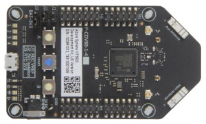
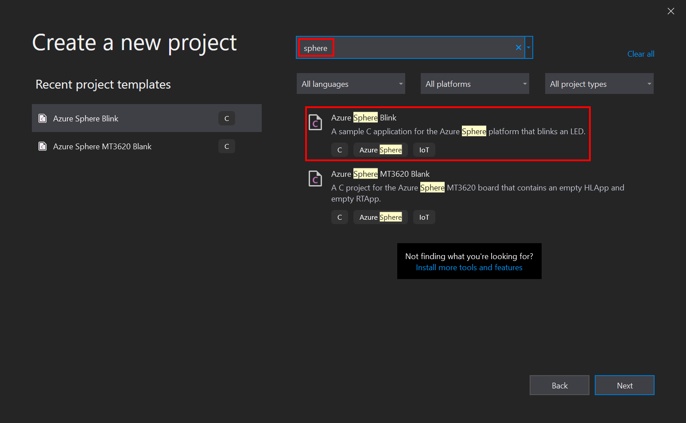
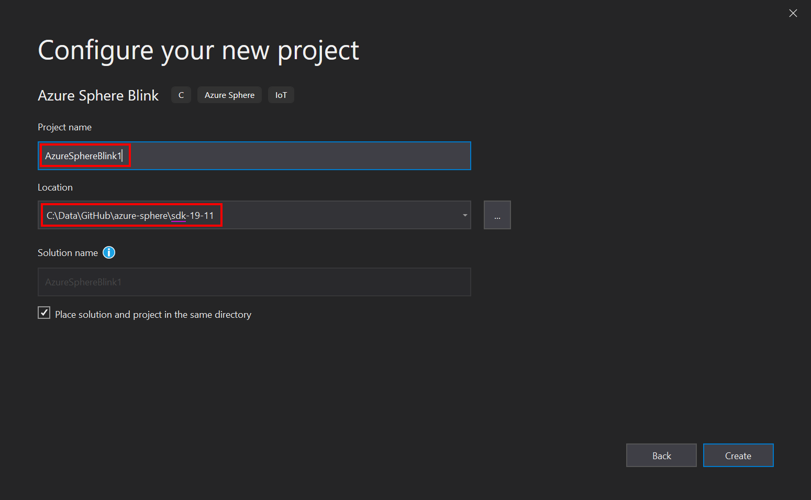
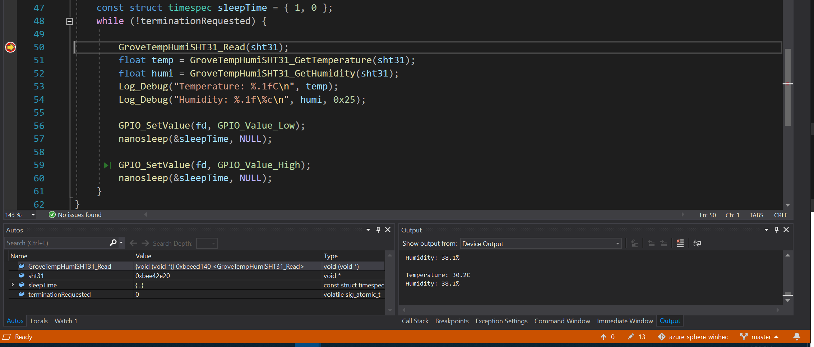

# Getting started with the Azure Sphere MT3620 Development Kit

| Azure Sphere   |  Image  |
| ---- | ---- |
| Azure Sphere MT3620 Development Kit |  |
| Azure Sphere MT3620 Development Kit Shield |  |

## Set up your Development Environment

This walk through assumes Windows and Visual Studio. For now application templates are only available with Visual Studio. However you can clone and open this solution on Ubuntu 18.04 and Visual Studio Code.

Follow the Azure Sphere [Overview of set-up procedures](https://docs.microsoft.com/en-au/azure-sphere/install/overview) guide.

## Hardware Required

This walk through is requires the Seeed Studio Azure Sphere, the Seeed Studio Grove Shield, and the Grove Temperature and Humidity Senor (SHT31). The Grove Temperature Sensor is plugged into one of the I2C connectors.


## Create new Visual Studio Azure Sphere Project

Start Visual Studio and create a new project.


### Select Azure Sphere Project Template

Type **sphere** in the search box and select the Azure Sphere Blink template.



### Configure new Azure Sphere Project

Name the project and set the save location.



### Open CMakeLists.txt

CMakelists.txt defines the build process, the files and locations of libraries and more.


### Add Reference to MT3620_Grove_Shield_Library

Two items need to be added:

1. The source location on the MT3620 Grove Shield library
2 Add MT3620_Grove_Shield_Library to the target_link_libraries definition. This is equivalent to add reference.


## Set the Application Capabilities

The app manifest defines what resources will be available to the application. Define the minimum set of privileges required by the application. This is core to one of the aspects of security on the Azure Sphere and also known as the [Principle of least privilege](https://en.wikipedia.org/wiki/Principle_of_least_privilege).

1. Review the [Capabilities by Sensor Type Quick Reference](#capabilities-by-sensor-type-quick-reference)
2. Open **app_manifest.json**
3. Add Uart **ISU0**
   - Note, access to the I2C SHT31 temperature/humidity sensor via the Grove Shield was built before Azure Sphere supported I2C. Hence calls to the sensor are proxied via the Uart.
4. Note, GPIO 9 is used to control an onboard LED.

```json
{
  "SchemaVersion": 1,
  "Name": "AzureSphereBlink1",
  "ComponentId": "a3ca0929-5f46-42b0-91ba-d5de1222da86",
  "EntryPoint": "/bin/app",
  "CmdArgs": [],
  "Capabilities": {
    "Gpio": [ 9 ],
    "Uart": [ "ISU0" ],
    "AllowedApplicationConnections": []
  },
  "ApplicationType": "Default"
}
```

### Update the Code

The following code includes the Grove Sensor headers, opens the Grove Sensor, and the loops reading the temperature and humidity and writes this information to the debugger logger.

Replace all the existing code in the **main.c** file with the following:

```c
#include <signal.h>
#include <stdbool.h>
#include <stdlib.h>
#include <string.h>
#include <time.h>
#include <errno.h>

#include <applibs/log.h>
#include <applibs/gpio.h>

// Grove Temperature and Humidity Sensor
#include "../MT3620_Grove_Shield/MT3620_Grove_Shield_Library/Grove.h"
#include "../MT3620_Grove_Shield/MT3620_Grove_Shield_Library/Sensors/GroveTempHumiSHT31.h"

static volatile sig_atomic_t terminationRequested = false;

static void TerminationHandler(int signalNumber)
{
	// Don't use Log_Debug here, as it is not guaranteed to be async signal safe
	terminationRequested = true;
}

int main(int argc, char* argv[])
{
	Log_Debug("Application starting\n");

	// Register a SIGTERM handler for termination requests
	struct sigaction action;
	memset(&action, 0, sizeof(struct sigaction));
	action.sa_handler = TerminationHandler;
	sigaction(SIGTERM, &action, NULL);

	// Change this GPIO number and the number in app_manifest.json if required by your hardware.
	int fd = GPIO_OpenAsOutput(9, GPIO_OutputMode_PushPull, GPIO_Value_High);
	if (fd < 0) {
		Log_Debug(
			"Error opening GPIO: %s (%d). Check that app_manifest.json includes the GPIO used.\n",
			strerror(errno), errno);
		return -1;
	}

	// Initialize Grove Shield and Grove Temperature and Humidity Sensor
	int i2cFd;
	GroveShield_Initialize(&i2cFd, 115200);
	void* sht31 = GroveTempHumiSHT31_Open(i2cFd);

	const struct timespec sleepTime = { 1, 0 };
	while (!terminationRequested) {

		GroveTempHumiSHT31_Read(sht31);
		float temp = GroveTempHumiSHT31_GetTemperature(sht31);
		float humi = GroveTempHumiSHT31_GetHumidity(sht31);
		Log_Debug("Temperature: %.1fC\n", temp);
		Log_Debug("Humidity: %.1f\%c\n", humi, 0x25);

		GPIO_SetValue(fd, GPIO_Value_Low);
		nanosleep(&sleepTime, NULL);

		GPIO_SetValue(fd, GPIO_Value_High);
		nanosleep(&sleepTime, NULL);
	}
}
```

## Deploy the Application to the Azure Sphere

1. Connect the Azure Sphere to computer via USB
2. Ensure you have [claimed](https://docs.microsoft.com/en-au/azure-sphere/install/claim-device), [connected](https://docs.microsoft.com/en-au/azure-sphere/install/configure-wifi), and [developer enabled](https://docs.microsoft.com/en-au/azure-sphere/install/qs-blink-application) your Azure Sphere.

3. Select **GDB Debugger (HLCore)** from the **Select Startup** dropdown.
	
4. From Visual Studio, press **F5** to build, deploy, start, and attached the remote debugger to the Azure Sphere.

### View the Debugger Output

Open the Output window to view the output from **Log_Debug** statements. You can do this by using the **Ctrl+Alt+O** keyboard shortcut or click the **Output** tab.


### Set a Debug Breakpoint

Set a debugger breakpoint by clicking in the margin to the left of the line of code you want the debugger to stop at.

In the **main.c** file, set a breakpoint in the margin of the line that reads the Grove temperature and pressure sensor **GroveTempHumiSHT31_Read(sht31);**.

 

## Integrating with Azure IoT Central

The Azure Sphere includes out of the box support for Azure IoT Hub and IoT Central. For this walk through
I'm using Azure IoT Central for built in charting, analytics, device customization and the ability to "White Label" with my own branding.

Review [Set up Azure IoT Central to work with Azure Sphere](https://docs.microsoft.com/en-us/azure-sphere/app-development/setup-iot-central)

In summary:

1. Open an Azure Sphere Developer Command Prompt
2. Authenticate ``` azsphere login ```
3. Download the Certificate Authority (CA) certificate for your Azure Sphere tenant ``` azsphere tenant download-CA-certificate --output CAcertificate.cer ```
4. Upload the tenant CA certificate to Azure IoT Central and generate a verification code
5. Verify the tenant CA certificate
6. Use the validation certificate to verify the tenant identity

## Capabilities by Sensor Type Quick Reference

| Sensors  | Socket | Capabilities |
| :------------- | :------------- | :----------- |
| Grove Light Sensor  | Analog | "Gpio": [ 57, 58 ], "Uart": [ "ISU0"] |
| Grove Rotary Sensor | Analog | "Gpio": [ 57, 58 ], "Uart": [ "ISU0"] |
| Grove 4 Digit Display | GPIO0 or GPIO4 | "Gpio": [ 0, 1 ] or "Gpio": [ 4, 5 ] |
| Grove LED Button | GPIO0 or GPIO4 |  "Gpio": [ 0, 1 ] or "Gpio": [ 4, 5 ] |
| Grove Oled Display 96x96 | I2C | "Uart": [ "ISU0"]  |
| Grove Temperature Humidity SHT31 | I2C | "Uart": [ "ISU0"] |
| Grove UART3 | UART3 | "Uart": [ "ISU3"] |
| LED 1 | Red <br/> Green <br/> Blue | "Gpio": [ 8 ] <br/> "Gpio": [ 9 ] <br/> "Gpio": [ 10 ] |
| LED 2 | Red <br/> Green <br/> Blue | "Gpio": [ 15 ] <br/> "Gpio": [ 16 ] <br/> "Gpio": [ 17 ] |
| LED 3 | Red <br/> Green <br/> Blue | "Gpio": [ 18 ] <br/> "Gpio": [ 19 ] <br/> "Gpio": [ 20 ] |
| LED 4 | Red <br/> Green <br/> Blue | "Gpio": [ 21 ] <br/> "Gpio": [ 22 ] <br/> "Gpio": [ 23 ] |

For more pin definitions see the __mt3620_rdb.h__ in the MT3620_Grove_Shield/MT3620_Grove_Shield_Library folder.
